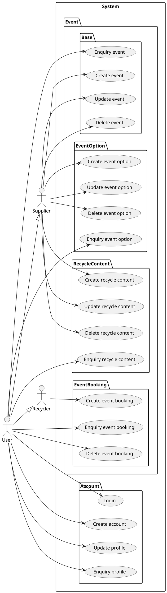
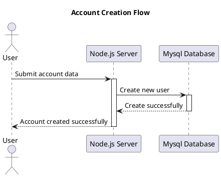
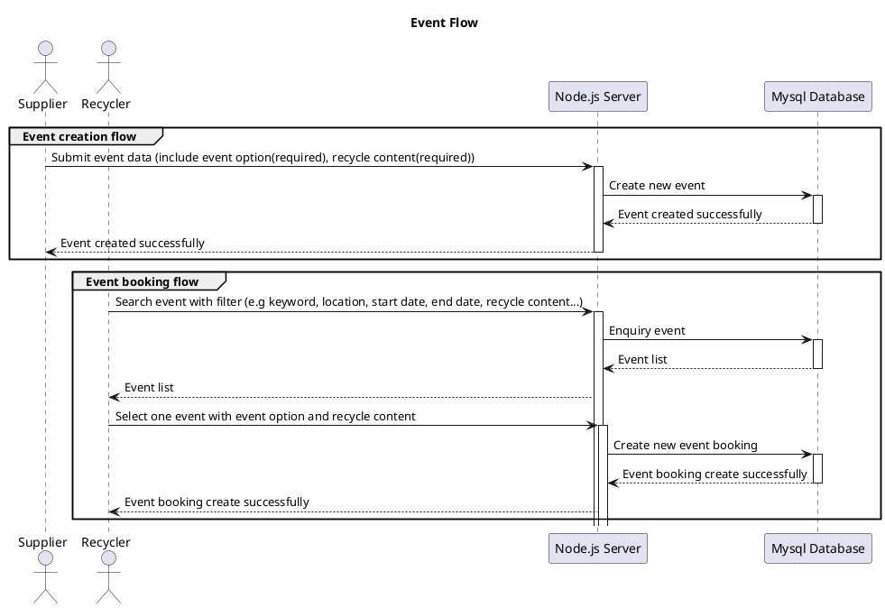

```plantuml
@startuml

scale 2

left to right direction

actor User
actor Supplier
actor Recycler


User --|> Supplier
User --|> Recycler
rectangle System {


  package Account {
    User --> (Login)
    User --> (Create account)
    User --> (Update profile)
    User --> (Enquiry profile)
  }


  package Event {

    package Base{
        User --> (Enquiry event)

    Supplier --> (Create event)
    Supplier --> (Update event)
    Supplier --> (Delete event)

    }


    package EventOption{
      User --> (Enquiry event option)

      Supplier --> (Create event option)
      Supplier --> (Update event option)
      Supplier --> (Delete event option)
    }
    package RecycleContent{

      User --> (Enquiry recycle content)

      Supplier --> (Create recycle content)
      Supplier --> (Update recycle content)
      Supplier --> (Delete recycle content)

    }
    package EventBooking{
      User --> (Enquiry event booking)
      Recycler --> (Create event booking)
      User --> (Delete event booking)

    }

  }

}
@enduml
```

```plantuml

@startuml
title Account Creation Flow

actor User
participant "Node.js Server" as Server
participant "Mysql Database" as DB

User -> Server: Submit account data
activate Server

Server -> DB: Create new user
activate DB
DB --> Server: Create successfully
deactivate DB

Server --> User: Account created successfully
deactivate Server
@enduml
```

```plantuml

@startuml
title Event Flow

actor Supplier
actor Recycler

participant "Node.js Server" as Server
participant "Mysql Database" as DB

group Event creation flow
  Supplier -> Server: Submit event data (include event option(required), recycle content(required))
  activate Server

  Server -> DB: Create new event
  activate DB
  DB --> Server: Event created successfully
  deactivate DB

  Server --> Supplier: Event created successfully
  deactivate Server
end

group Event booking flow

  Recycler -> Server: Search event with filter (e.g keyword, location, start date, end date, recycle content...)
  activate Server

  Server -> DB: Enquiry event
  activate DB
  DB --> Server: Event list
  deactivate DB

  Server --> Recycler: Event list


  Recycler -> Server: Select one event with event option and recycle content
  activate Server

  Server -> DB: Create new event booking
  activate DB
  DB --> Server: Event booking create successfully
  deactivate DB

  Server --> Recycler: Event booking create successfully
end

@enduml
```
